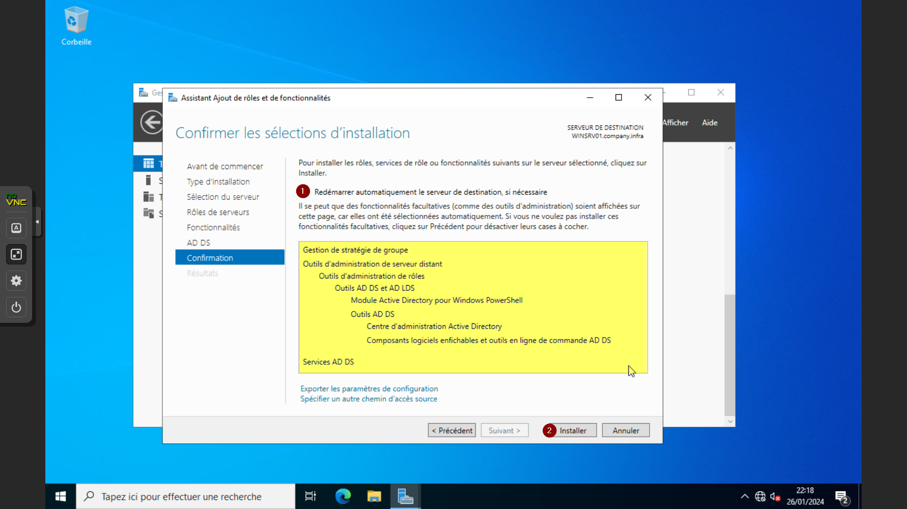
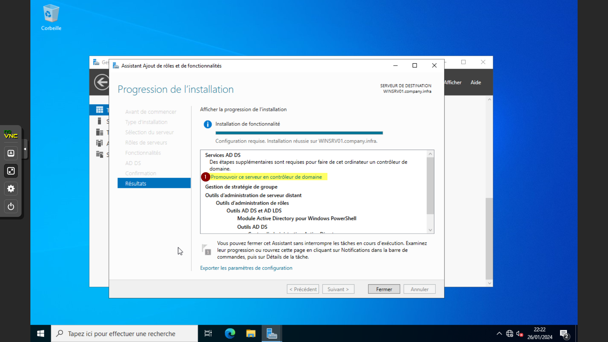
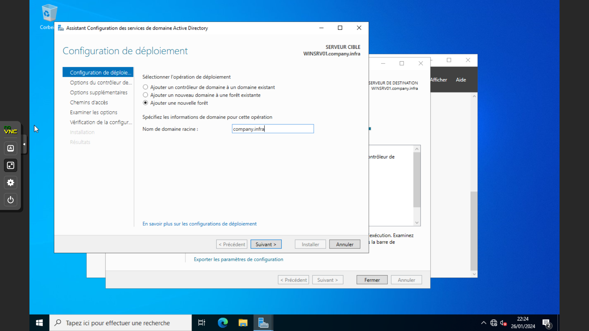
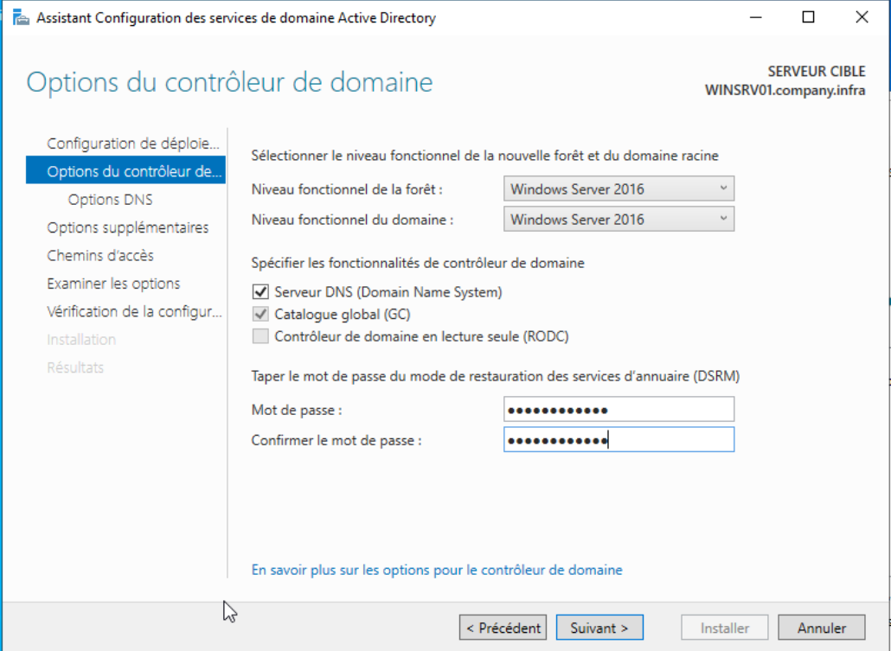

# Active Directory Windows Server 2022

## Introduction & Prérequis

Bienvenue dans ce guide complet qui vous guidera à travers le processus d'installation d'Active Directory sur un serveur Windows Server 2022. Suivez attentivement les étapes ci-dessous pour créer votre domaine Active Directory.  
Active Directory est la mise en œuvre par Microsoft des services d'annuaire LDAP pour les systèmes d'exploitation Windows.

> **[Active Directory]**  
> L'Active Directory est un annuaire LDAP pour les systèmes d'exploitation Windows, le tout étant créé par Microsoft. Cet annuaire contient différents objets, de différents types (utilisateurs, ordinateurs, etc.), l'objectif étant de centraliser deux fonctionnalités essentielles : l'identification et l'authentification au sein d'un système d'information.

> **[Liens 🔗]**
> 
> * [Pourquoi un annuaire Active Directory ?](https://www.it-connect.fr/chapitres/un-annuaire-active-directory-pourquoi/)
> * [Vue d'ensemble des services de domaine Active Directory](https://learn.microsoft.com/fr-fr/windows-server/identity/ad-ds/get-started/virtual-dc/active-directory-domain-services-overview)
> * [Active Directory - Wikipédia](https://fr.wikipedia.org/wiki/Active_Directory)

**ADillustration**

### Prérequis

Pour suivre ce guide dans de bonnes conditions assurez vous d'avoir à disposition un Windows Server 2022 avec le mot de passe administrateur.  
Ayez aussi une machine Windows 10 / 11 pour effectuer de futurs test que l'on ne verra pas dans ce guide.

> **Explication détaillée** : Dans ce guide nous partons d'un fresh install de Windows Server 2022 donc quelques parties seront dédiés à la configuration du Serveur.
> 
> * Naviguez dans la barre de droite pour vous déplacez à l'endroit qui vous intéresse.

## Première connexion

### Mot De Passe Administrateur

Après avoir terminé l'installation de Windows Server 2022 en suivant ce guide vous allez devoir définir un mot de passe robuste pour votre serveur.  
Pour des questions de sécurités évidentes ce mot de passe ne doit être connu & accessible uniquement aux Administrateurs Systèmes & Réseaux de votre entreprise.

> **[Sécurité 🔐]**  
> Pour plus de sécurité utiliser un gestionnaire de mots de passe comme KeePass validé par l'ANSSI pour générer et stocker vos mots de passes.
> 
> **Explication détaillée** :
> 1. **Complexité du mot de passe** : Utilisez au minimum 12 caractères avec majuscules, minuscules, chiffres et symboles
> 2. **Gestionnaire de mots de passe** : KeePass est recommandé par l'ANSSI (Agence Nationale de la Sécurité des Systèmes d'Information)
> 3. **Rotation régulière** : Changez le mot de passe administrateur tous les 90 jours
> 4. **Accès restreint** : Seuls les administrateurs système et réseau doivent connaître ce mot de passe

### Déverrouillage (VM PVE)

Pour accèder à votre Window Server vous devez d'abord le déverrouillez en utilisant les touches `CTRL` + `ALT` + `SUPPR`.  
Cela ne pose pas réellement de problème lorsque vous êtes sur un serveur Physique mais lorsque vous utiliser un VM vous devez utiliser les raccourcis rédéfinis par noVNC.

* Cliquez sur le Chevron à votre gauche pour déployer la barre latérale
* Cliquez sur l'icone de Touche A
* Cliquez sur l'icone des trois touches tout en bas.

Désormais vous avez accès à l'écran de connexion.  
Saisissez vos Identifiants et patientez.

> **[CHARGEMENT ...]**  
> En fonction des ressources attribués à votre Serveur la première connexion peut être plus ou moins longue
> 
> **Explication détaillée** :
> 1. **Temps de connexion** : La première connexion peut prendre 2-5 minutes selon les ressources allouées
> 2. **Configuration automatique** : Windows Server configure automatiquement les services au premier démarrage
> 3. **Patience requise** : Évitez d'interrompre le processus de démarrage initial

### Gestionnaire de Serveur

Le Gestionnaire de serveur est une console de gestion disponible dans Windows Server, qui aide les professionnels de l'informatique à provisionner et à gérer des serveurs Windows locaux ou distants directement depuis leur Bureau, sans avoir besoin d'accéder physiquement aux serveurs ni d'activer des connexions RDP (Remote Desktop Protocol) pour chaque serveur.

* [Gestionnaire de serveur - Documentation Microsoft](https://learn.microsoft.com/fr-fr/windows-server/administration/server-manager/server-manager)

Le Gestionnaire de Serveur se lancera automatiquement à chaque démarrage de Windows Server.

> **Explication détaillée** :
> 1. **Console centralisée** : Le Gestionnaire de serveur permet de gérer plusieurs serveurs depuis une interface unique
> 2. **Démarrage automatique** : Il se lance automatiquement au démarrage de Windows Server
> 3. **Gestion des rôles** : Permet d'installer et configurer les rôles et fonctionnalités
> 4. **Surveillance** : Affiche l'état des services et des événements système

## Configuration du Serveur

### Adressage IP

Pour ce guide je suis dans un environnement de test et donc je ne suis pas soumis à à un adressage IP prédéfinie.  
Je vais alors procéder de cette manière :

* IP Windows Serveur : _192.168.50.1 /24_
* Passerelle Par défaut : _192.168.50.254_
* DNS ce sera notre Windows Serveur alors on met _127.0.0.1_ soit lui-même

> **Explication détaillée** :
> 1. **Configuration IP statique** : Évitez l'IP dynamique pour un serveur de domaine
> 2. **Adresse IP** : 192.168.50.1/24 (réseau privé classe C)
> 3. **Passerelle** : 192.168.50.254 (routeur/gateway)
> 4. **DNS local** : 127.0.0.1 (le serveur sera son propre DNS)
> 5. **Configuration réseau** : Panneau de configuration → Réseau et Internet → Centre réseau et partage

### Renommer le Serveur

On va désormais nommer notre serveur en remplaçant celui par défaut.  
Pour cela rendez vous sur le Gestionnaire De Serveur :

* Cliquez sur Serveur Local puis sur son nom.
* Dans Propriétés Systèmes clique sur modifier puis sur autres
* Renseigner le domain et le nom , le nom complet s'affichera après

> **[NOMMER SON SERVEUR]**  
> Pour nommer votre serveur soyez assez simple et explicite pour pouvoir l'identifier facilement.  
> Dans mon cas j'ai nommer mon serveur : _WINSRV01_
> 
> **Explication détaillée** :
> 1. **Nommage cohérent** : Utilisez une convention de nommage claire (ex: WINSRV01, DC01, SRV-DC-01)
> 2. **Éviter les caractères spéciaux** : Utilisez uniquement des lettres, chiffres et tirets
> 3. **Longueur maximale** : 15 caractères maximum pour la compatibilité NetBIOS
> 4. **Redémarrage obligatoire** : Le changement de nom nécessite un redémarrage

Après avoir nommer votre serveur vous allez être dans l'obligation de redémarrez votre serveur

### Démarrage des services.

Après avoir redémarrez votre serveur et vous être reconnecter vous arrivez une nouvelle fois sur le Gestionnaire De Serveur.  
Ne le fermez pas nous allons vérifier que tous les services soient bien démarrés.  
Pour cela :

* Cliquez sur la partie services de votre serveur local
* Un fenêtre s'ouvre
* Faites un clique droit sur les services et selectionnez démarrez les services.

Vous êtes désormais passé dans le vert.

> **[Passage au Vert]**  
> Si votre fenêtre Serveur Local est encore en Rouge alors répeter les étapes précédentes pour démarrez chaque service.
> 
> **Explication détaillée** :
> 1. **Services essentiels** : Windows Update, Windows Defender, etc.
> 2. **État des services** : Vérifiez que tous les services critiques sont en cours d'exécution
> 3. **Indicateur visuel** : Le passage au vert indique que tous les services sont opérationnels
> 4. **Dépannage** : Si des services sont en erreur, consultez les journaux d'événements

## Installation d'Active Directory

L'étape cruciale de l'installation d'Active Directory est maintenant devant vous. Active Directory (AD) joue un rôle central dans la gestion des utilisateurs, des groupes, et des ressources dans un environnement Windows. Suivez ces instructions pour intégrer votre serveur dans le monde d'Active Directory.

### Ajouter le Rôle AD

Dans le gestionnaire de serveur en haut à droite cliquez sur Gérer

* Sélectionnez ensuite "Ajouter des Rôles et Fonctionnalités"
* Vous êtes désormais dans l'assistant d'ajout de rôle et de fonctionnalités .
* Faites Suivant et sélectionnez votre serveur Local sur lequel vous souhaitez ajoutez l'Active Directory
* Ensuite selectionnez le rôle "AD DS" puis ajoutez les fonctionnalités
* Après vérifiez tout dans la fenêtre de confirmation puis installer

> **Explication détaillée** :
> 1. **Assistant d'installation** : L'assistant guide à travers l'installation des rôles
> 2. **Sélection du serveur** : Choisissez le serveur local ou distant
> 3. **Rôle AD DS** : Active Directory Domain Services est le rôle principal
> 4. **Fonctionnalités automatiques** : L'assistant ajoute automatiquement les fonctionnalités nécessaires
> 5. **Confirmation** : Vérifiez tous les éléments avant l'installation

### Promouvoir en Contrôleur de Domaine

Désormais nous sommes à une étape primordiale qui est de promouvoir notre serveur en contrôleur de domaine.  
Pour cela à la fin de l'installation de Active Directory ne fermez pas la fenêtre de l'assistant et cliquez sur le lien bleu.

On va maintenant configurer le déploiement d'Active Directory.

* Choisissez votre nom de domaine qui correspond à ce que vous avez choisi ici
* Pas de Délégation DNS
* Laisser les chemins d'accès par défaut

> **Explication détaillée** :
> 1. **Nom de domaine** : Choisissez un nom de domaine interne (ex: company.local, domaine.local)
> 2. **Niveau fonctionnel** : Windows Server 2022 (niveau le plus élevé)
> 3. **Délégation DNS** : Laissez "Pas de délégation DNS" pour un nouveau domaine
> 4. **Chemins par défaut** : Acceptez les chemins par défaut pour les bases de données AD
> 5. **Mode de restauration** : Configurez un mot de passe fort pour le mode de restauration

> **Explication détaillée** :
> 1. **Configuration DNS** : Le serveur DNS sera installé automatiquement
> 2. **Options de configuration** : Vérifiez toutes les options avant la promotion
> 3. **Vérification des prérequis** : L'assistant vérifie automatiquement les prérequis
> 4. **Installation** : La promotion peut prendre 10-20 minutes selon les performances

## Conclusion

> **[Bien Joué ! ✔️]**  
> Voilà vous avez désormais réussi à installer votre Active Directory sur Windows Serveur 2022.

Explorez les fonctionnalités d'AD pour administrer votre domaine. 🚀

> **Explication détaillée** :
> 1. **Post-installation** : Vérifiez que le domaine est opérationnel
> 2. **Outils d'administration** : Utilisez l'outil "Utilisateurs et ordinateurs Active Directory"
> 3. **Premiers objets** : Créez vos premiers utilisateurs et groupes
> 4. **Sauvegarde** : Planifiez des sauvegardes régulières de votre contrôleur de domaine
> 5. **Sécurité** : Configurez les stratégies de groupe et la sécurité

> **[Liens 🔗]**
> 
> * [Cours Active Directory - IT-Connect](https://www.it-connect.fr/cours-tutoriels/administration-systemes/windows-server/windows-active-directory/)
> * [Tutoriel vidéo Active Directory](https://www.youtube.com/watch?v=nhW-0qZzjy4)
> * [Active Directory - Wikipédia](https://fr.wikipedia.org/wiki/Active_Directory)

---

## Prochaines étapes

1. **Configuration des utilisateurs** : Créez vos premiers comptes utilisateurs
2. **Stratégies de groupe** : Configurez les GPO pour sécuriser votre domaine
3. **Sauvegarde** : Mettez en place une stratégie de sauvegarde
4. **Monitoring** : Surveillez la santé de votre contrôleur de domaine
5. **Tests** : Testez l'authentification depuis des postes clients

> **Félicitations ! 🎉** Vous avez maintenant un environnement Active Directory fonctionnel sur Windows Server 2022.
