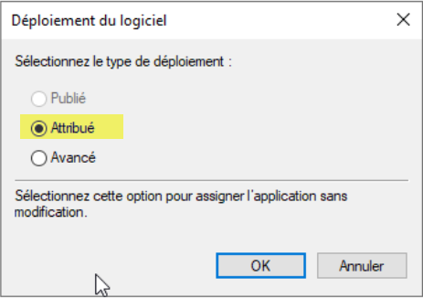
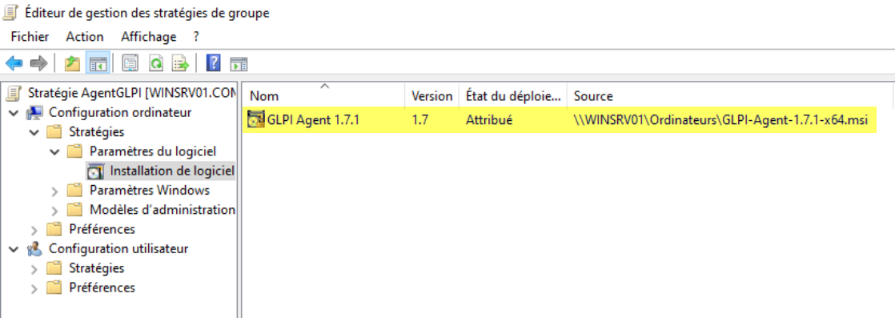
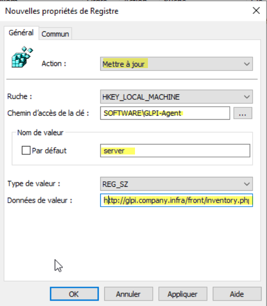
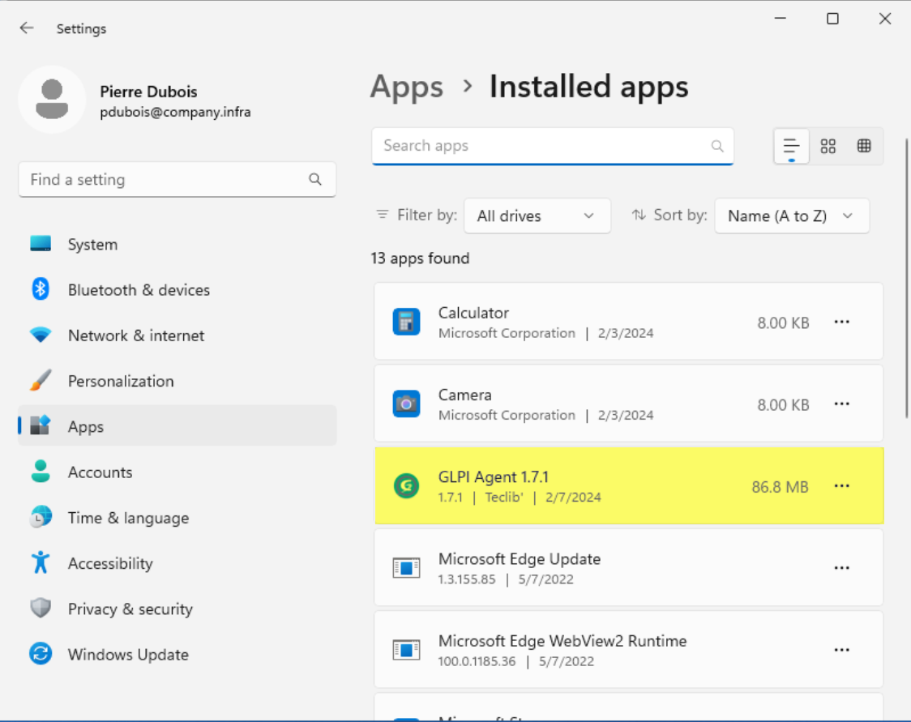
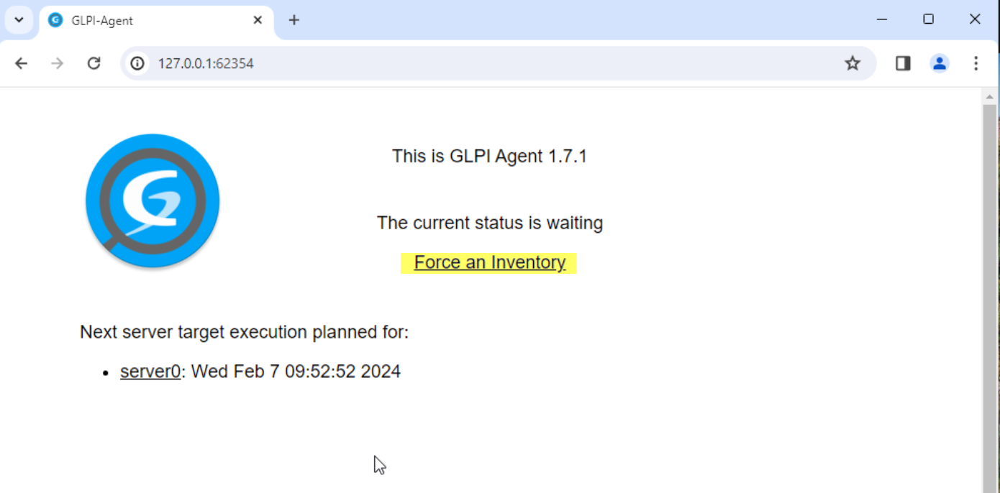
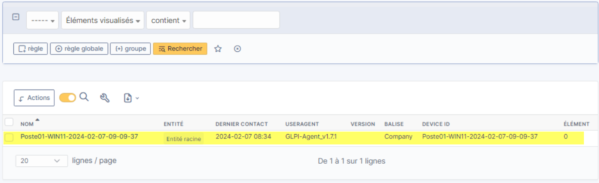

### Déploiement de l'Agent GLPI via une GPO

#### Introduction & Prérequis
Ce guide explique comment déployer l'Agent GLPI sur des postes Windows à l'aide d'une Stratégie de Groupe (GPO). L'Agent GLPI collecte l'inventaire matériel/logiciel et l'envoie à votre serveur GLPI.

- **Objectif**: déployer automatiquement l'Agent GLPI et configurer le serveur de collecte.
- **Public**: administrateurs Active Directory/GLPI.

#### Prérequis
- **Fichier d'installation**: téléchargez l'installateur MSI de l'Agent GLPI compatible avec votre version de GLPI.
- **Partage réseau**: hébergez le MSI sur un partage accessible en lecture par les ordinateurs cibles (ex: `\\srv\\deploiement\\GLPI-Agent\\glpi-agent-x.y.z-x64.msi`).
- **GLPI**: activez la fonction d'inventaire côté GLPI pour recevoir les données.

- **Droits AD**: permissions pour créer/éditer des GPO et lier à l'OU concernée.

---

#### Étape 1 — Préparer le fichier MSI
1. Téléchargez le `.msi` de l'Agent GLPI.
2. Copiez le fichier dans le partage réseau (chemin UNC) accessible aux ordinateurs.

> Astuce: utilisez un chemin UNC stable (pas de lecteur mappé), sinon l'installation au démarrage échouera.


#### Étape 2 — Créer la GPO « AgentGLPI »
1. Ouvrez la console Gestion de stratégie de groupe (GPMC).
2. Cliquez droit sur votre domaine ou l'OU cible → « Créer un objet GPO dans ce domaine et le lier ici… ».
3. Nommez la GPO: `AgentGLPI`.


#### Étape 3 — Ajouter le package MSI (installation attribuée)
1. Éditez la GPO `AgentGLPI`.
2. Accédez à: `Configuration ordinateur > Stratégies > Paramètres du logiciel > Installation de logiciel`.
3. Clic droit → « Nouveau » → « Package ».
4. Saisissez le chemin UNC du MSI (ex: `\\srv\\deploiement\\GLPI-Agent\\glpi-agent-x.y.z-x64.msi`).
5. Choisissez **Attribué** comme mode d'installation.

> Remarque: le mode « Attribué » installe l'application au démarrage de la machine.




#### Étape 4 — Configurer les paramètres du Registre (serveur et tag)
Dans la même GPO:

- Allez dans `Configuration ordinateur > Préférences > Paramètres Windows > Registre`.
- Ajoutez les éléments suivants:

```
Action: Mettre à jour
Ruche: HKEY_LOCAL_MACHINE
Chemin d'accès de la clé: SOFTWARE\GLPI-Agent
Nom de valeur: server
Type de valeur: REG_SZ
Données de valeur: http://glpi.company.infra/front/inventory.php
```


```
Action: Mettre à jour
Ruche: HKEY_LOCAL_MACHINE
Chemin d'accès de la clé: SOFTWARE\GLPI-Agent
Nom de valeur: tag
Type de valeur: REG_SZ
Données de valeur: Company
```


> Adaptez l'URL du serveur GLPI et le « tag » à votre environnement.

#### Étape 5 — Lier et appliquer la GPO
1. Liez la GPO `AgentGLPI` à l'OU contenant les comptes ordinateurs visés.
2. Vérifiez le filtrage de sécurité (groupe « Authenticated Users » ou groupe dédié des PCs cibles).
3. Forcez la mise à jour des stratégies sur un poste de test:

```powershell
gpupdate /force
```

4. Redémarrez le poste client pour déclencher l'installation attribuée.

#### Étape 6 — Vérifier l'installation côté poste
- Dans « Applications et fonctionnalités », vérifiez que **GLPI Agent** est installé.

- Vérifiez l'interface locale de l'agent:

```
http://127.0.0.1:62354
```


- Depuis cette interface, vous pouvez forcer l'envoi d'un inventaire.

#### Étape 7 — Vérifier la remontée dans GLPI
- Connectez-vous à l’interface d’administration GLPI.
- Ouvrez la section « Inventaire » (ou via l'icône Robot selon votre version).
- Recherchez le poste testé et confirmez la réception de l'inventaire.


---

#### Dépannage rapide
- **Le MSI ne s’installe pas**: vérifiez que le chemin UNC est accessible par l’ordinateur au démarrage, et que le compte ordinateur a les droits de lecture.
- **Règles de registre non appliquées**: contrôlez `gpresult /h report.html` et la portée de la GPO.
- **Inventaire non reçu**: testez l’URL serveur configurée, la connectivité réseau et les logs de l’agent.

---


