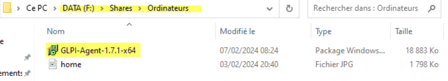
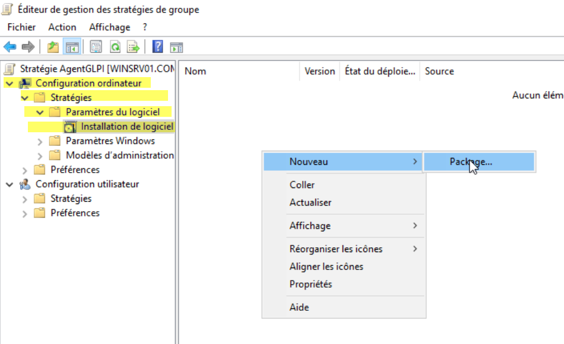

# Déploiement de l'Agent GLPI via une GPO

## Introduction & Prérequis

Ce guide vous aidera à déployer l'Agent GLPI sur les postes clients de votre réseau à l'aide d'une GPO (Stratégie de Groupe). L'Agent GLPI permet de collecter des informations sur les postes clients et de les remonter à votre serveur GLPI pour un inventaire complet et précis.

**AgentGLPI**

### Prérequis

Avant de commencer, assurez-vous d'avoir :

* **Téléchargé le fichier d'installation de l'Agent GLPI** compatible avec la version de GLPI installée.
* **Mis en place un partage réseau** accessible aux ordinateurs du réseau pour héberger le fichier d'installation.
* **Activé la fonction d'inventaire dans GLPI** pour recevoir les données des postes clients.



## Déploiement de l'Agent GLPI via une GPO

### Téléchargement du Fichier d'Installation

Téléchargez le fichier d'installation de l'Agent GLPI (.msi) compatible avec votre version de GLPI.

> **Explication détaillée** : Le fichier MSI de l'Agent GLPI est disponible sur le site officiel de GLPI. Assurez-vous de télécharger la version correspondant à votre architecture (32-bit ou 64-bit) et compatible avec votre version de GLPI. Le nom du fichier suit généralement le format `glpi-agent-x.y.z-x64.msi` où x.y.z correspond à la version.

### Placement du Fichier MSI

Placez le fichier MSI dans un partage réseau accessible aux ordinateurs du réseau.


> **Explication détaillée** : Le partage réseau doit être accessible en lecture par les comptes ordinateurs du domaine. Utilisez un chemin UNC (Universal Naming Convention) de type `\\serveur\partage\glpi-agent-x.y.z-x64.msi`. Évitez les chemins avec des lettres de lecteur mappées car elles ne sont pas disponibles lors du démarrage de l'ordinateur.

### Création de la GPO "AgentGLPI"

Dans le dossier des GPO, créez une nouvelle GPO nommée "AgentGLPI".


> **Explication détaillée** : 
> 1. Ouvrez la console **Gestion de stratégie de groupe** (GPMC) depuis un serveur avec les outils d'administration Active Directory
> 2. Naviguez vers votre domaine dans l'arborescence
> 3. Cliquez droit sur votre domaine ou l'Unité d'Organisation (OU) cible
> 4. Sélectionnez **"Créer un objet GPO dans ce domaine et le lier ici..."**
> 5. Nommez la GPO : **"AgentGLPI"**
> 6. La GPO sera créée et automatiquement liée à l'OU sélectionnée

### Modification de la GPO

Modifiez la GPO en accédant à "Configuration ordinateur > Stratégies > Paramètres du logiciel > Installation de logiciel".

### Ajout du Package MSI

Sélectionnez "Nouveau Package" et choisissez l'emplacement réseau du fichier MSI de l'Agent GLPI.  
Sélectionnez "Attribué" pour le mode d'installation.



> **Explication détaillée** :
> 1. **Éditez la GPO** : Clic droit sur la GPO "AgentGLPI" → "Modifier"
> 2. **Naviguez vers** : `Configuration ordinateur > Stratégies > Paramètres du logiciel > Installation de logiciel`
> 3. **Ajoutez le package** : Clic droit dans le panneau de droite → "Nouveau" → "Package"
> 4. **Sélectionnez le fichier** : Naviguez vers le chemin UNC du MSI (ex: `\\srv\deploiement\GLPI-Agent\glpi-agent-x.y.z-x64.msi`)
> 5. **Choisissez le mode** : Sélectionnez **"Attribué"** comme mode d'installation


> **Explication du mode "Attribué"** : Le mode "Attribué" installe automatiquement l'application au démarrage de l'ordinateur, sans intervention de l'utilisateur. C'est idéal pour les déploiements d'agents de gestion.


### Configuration des Paramètres du Registre

```
Accédez à "Configuration ordinateur > Préférences > Paramètres Windows > Registre".
Ajoutez un nouvel élément de registre avec les informations suivantes :
Action : Mettre à jour.
Ruche : HKEY_LOCAL_MACHINE.
Chemin d'accès de la clé : SOFTWARE\GLPI-Agent.
Nom de valeur : server.
Type de valeur : REG_SZ.
Données de valeur : http://glpi.company.infra/front/inventory.php.
```


> **Explication détaillée** :
> 1. **Dans la même GPO** : Restez dans l'éditeur de la GPO "AgentGLPI"
> 2. **Naviguez vers** : `Configuration ordinateur > Préférences > Paramètres Windows > Registre`
> 3. **Créer un nouvel élément** : Clic droit dans le panneau de droite → "Nouveau" → "Élément de registre"
> 4. **Configurez les paramètres** :
>    - **Action** : Mettre à jour
>    - **Ruche** : HKEY_LOCAL_MACHINE
>    - **Chemin d'accès de la clé** : SOFTWARE\GLPI-Agent
>    - **Nom de valeur** : server
>    - **Type de valeur** : REG_SZ
>    - **Données de valeur** : http://glpi.company.infra/front/inventory.php
> 
> **Important** : Adaptez l'URL du serveur GLPI à votre environnement (remplacez `glpi.company.infra` par l'adresse de votre serveur GLPI).

### Ajout d'un Autre Paramètre de Registre

Ajoutez un autre élément de registre avec les informations suivantes :

```
Action : Mettre à jour
Ruche : HKEY_LOCAL_MACHINE
Chemin d'accès de la clé : SOFTWARE\GLPI-Agent
Nom de valeur : tag
Type de valeur : REG_SZ
Données de valeur : Company
```


> **Explication détaillée** :
> 1. **Créer un second élément** : Répétez la procédure précédente pour créer un autre élément de registre
> 2. **Configurez les paramètres** :
>    - **Action** : Mettre à jour
>    - **Ruche** : HKEY_LOCAL_MACHINE
>    - **Chemin d'accès de la clé** : SOFTWARE\GLPI-Agent
>    - **Nom de valeur** : tag
>    - **Type de valeur** : REG_SZ
>    - **Données de valeur** : Company
> 
> **Utilisation du tag** : Le tag permet de regrouper et identifier les postes dans GLPI. Vous pouvez utiliser des valeurs comme "Company", "ServiceIT", "Direction", etc., selon votre organisation.

### Application de la GPO

Appliquez la GPO à l'Unité d'Organisation (OU) "Ordinateurs" puis activez-la.  
**Mise à Jour de la GPO sur les Postes Clients :**

Sur le poste client, exécutez la commande `gpupdate /force` pour forcer la mise à jour de la GPO.

> **Explication détaillée** :
> 1. **Lier la GPO** : La GPO "AgentGLPI" doit être liée à l'OU contenant les comptes ordinateurs cibles
> 2. **Vérifier le filtrage** : Assurez-vous que le groupe "Authenticated Users" ou un groupe dédié a les permissions d'application
> 3. **Forcer la mise à jour** : Sur un poste de test, ouvrez une invite de commandes en tant qu'administrateur et exécutez :
>    ```cmd
>    gpupdate /force
>    ```
> 4. **Redémarrer** : Redémarrez le poste client pour déclencher l'installation automatique

### Redémarrage du Poste Client

Redémarrez le poste client pour appliquer les changements.

> **Explication détaillée** : Le redémarrage est nécessaire car les installations de logiciels via GPO en mode "Attribué" se font au démarrage de l'ordinateur, avant que l'utilisateur se connecte.

### Vérification de l'Installation de GLPI Agent

Sur le poste client, vérifiez dans les applications si GLPI Agent est installé.


> **Explication détaillée** :
> 1. **Ouvrez les paramètres Windows** : Démarrer → Paramètres → Applications
> 2. **Recherchez "GLPI Agent"** dans la liste des applications installées
> 3. **Vérifiez la version** : Assurez-vous que la version installée correspond à celle déployée
> 4. **Vérifiez le service** : Dans le Gestionnaire des tâches → Services, recherchez "GLPI Agent" et vérifiez qu'il est en cours d'exécution

### Forcer l'Envoi de l'Inventaire

Accédez au navigateur sur le poste client et utilisez l'adresse http://127.0.0.1:62354 pour forcer l'envoi de l'inventaire.


> **Explication détaillée** :
> 1. **Ouvrez un navigateur web** sur le poste client
> 2. **Accédez à l'interface locale** : http://127.0.0.1:62354
> 3. **Vérifiez la configuration** : L'interface affiche les paramètres configurés (serveur, tag, etc.)
> 4. **Lancez l'inventaire** : Cliquez sur le bouton "Inventaire" pour forcer la collecte et l'envoi des données
> 5. **Vérifiez le statut** : L'interface indique si l'envoi a réussi ou échoué

### Vérification dans l'Interface d'Administration de GLPI

Vérifiez sur l'interface d'administration de GLPI dans la section "Inventaire" si le poste client apparaît en cliquant sur l'icône Robot.


> **Explication détaillée** :
> 1. **Connectez-vous à GLPI** : Ouvrez votre navigateur et accédez à l'interface d'administration GLPI
> 2. **Naviguez vers l'inventaire** : Cliquez sur l'icône Robot ou allez dans la section "Inventaire"
> 3. **Recherchez le poste** : Le poste client devrait apparaître dans la liste avec le tag configuré
> 4. **Vérifiez les détails** : Cliquez sur le poste pour voir les informations collectées (matériel, logiciels, etc.)
> 5. **Vérifiez la date** : Assurez-vous que la dernière mise à jour correspond à l'heure de l'inventaire forcé

## Résultat

> **Bien Joué ! ✔️**  
> En suivant ces étapes, vous aurez déployé avec succès l'Agent GLPI sur vos postes clients via une GPO. 🖥️🛠️

> **Liens 🔗**  
> [Tutoriel IT-Connect : Installer et configurer GPO Agent GLPI Windows](https://www.it-connect.fr/tuto-installer-configurer-gpo-agent-glpi-windows/)  
> [Documentation officielle GLPI](https://docs.ldurand-it.fr/fr/Services/GLPI/glpigpo)

---

## Dépannage rapide

### Problèmes courants et solutions

- **Le MSI ne s'installe pas** : 
  - Vérifiez que le chemin UNC est accessible par l'ordinateur au démarrage
  - Assurez-vous que le compte ordinateur a les droits de lecture sur le partage
  - Vérifiez que le fichier MSI n'est pas corrompu

- **Règles de registre non appliquées** : 
  - Contrôlez avec `gpresult /h report.html` sur le poste client
  - Vérifiez la portée de la GPO et le filtrage de sécurité
  - Assurez-vous que la GPO est bien liée à l'OU cible

- **Inventaire non reçu** : 
  - Testez l'URL serveur configurée dans un navigateur
  - Vérifiez la connectivité réseau entre le poste et le serveur GLPI
  - Consultez les logs de l'agent GLPI dans le Gestionnaire d'événements

- **Agent GLPI ne démarre pas** : 
  - Vérifiez que le service "GLPI Agent" est configuré en démarrage automatique
  - Contrôlez les permissions du compte de service
  - Redémarrez le service si nécessaire

---

> **Félicitations ! 🎉** En suivant ce guide étape par étape, vous avez maintenant une solution complète pour déployer automatiquement l'Agent GLPI sur vos postes clients via GPO et centraliser vos inventaires informatiques dans GLPI.
