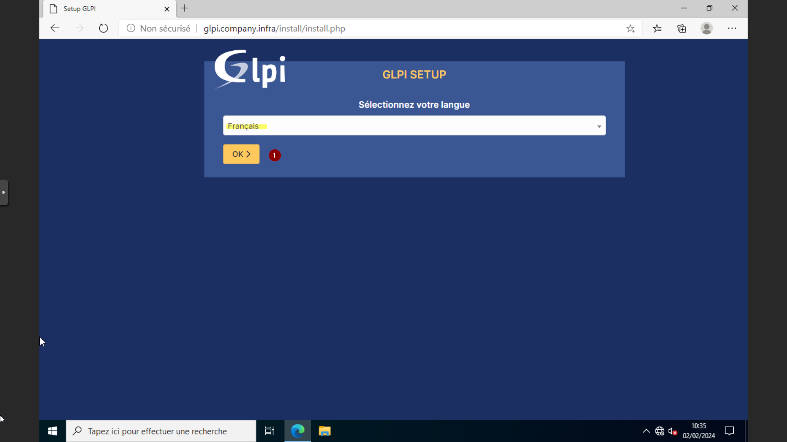
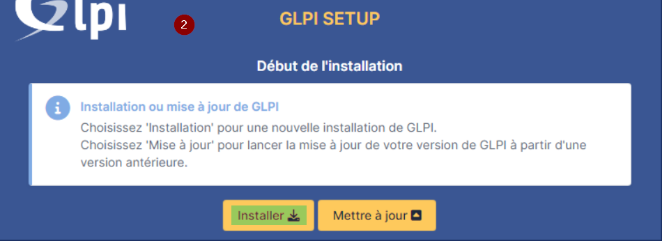
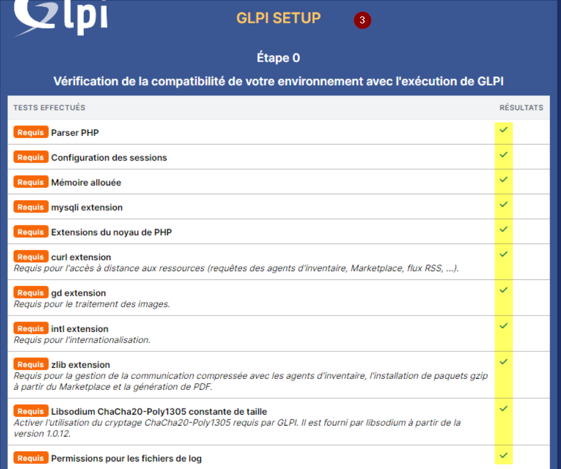
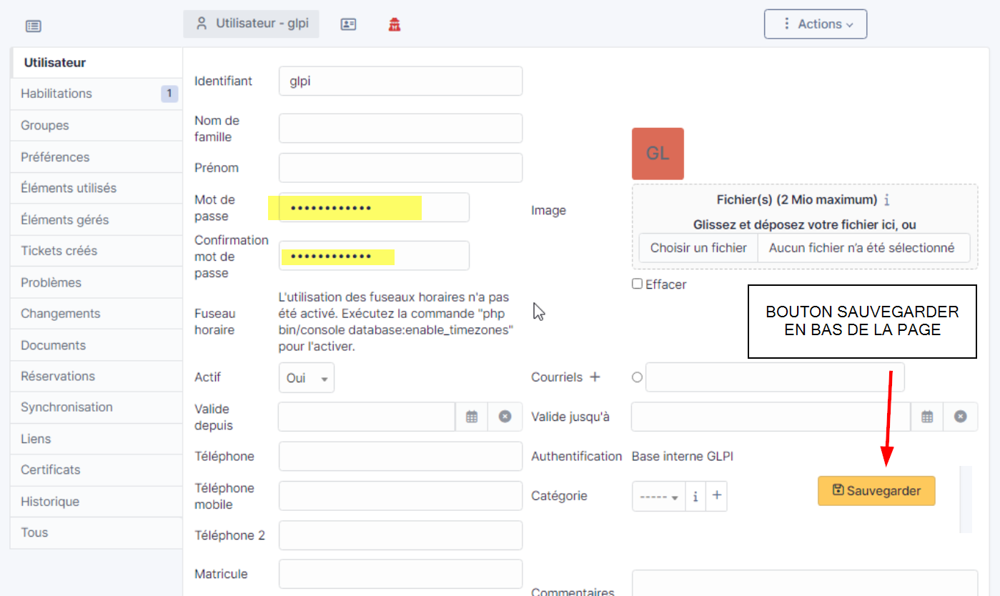

# Installation GLPI sur Debian 12 (CT PVE possible)

## Introduction & Prérequis

Bienvenue dans ce guide pas-à-pas pour installer GLPI (service desk et inventaire). Suivez chaque étape pour un déploiement propre et fonctionnel.

Prérequis conseillés (exemple pour un conteneur Debian 12) :
- 40 Go de stockage
- 1 vCPU
- 2 Go de RAM
- 512 Mo de SWAP
- Accès réseau et DNS fonctionnels

> Exemple dans un CT Proxmox (PVE) avec Debian 12 classique.

---

## Installation GLPI

### Mise à jour du système

```bash
apt update && apt upgrade -y
```

### Installation des dépendances

```bash
apt install -y apache2 php mariadb-server
apt install -y php-xml php-common php-json php-mysql php-mbstring php-curl php-gd php-intl php-zip php-bz2 php-imap php-apcu
apt install -y php-ldap
```

### Sécurisation de la base MariaDB

```bash
mysql_secure_installation
```

Répondez selon les recommandations habituelles :
- Unix switch ? N
- Change root password ? Y
- Remove anonymous users ? Y
- Disallow root login remotely ? Y
- Remove test database and access to it ? Y
- Reload privilege tables now ? Y

### Configuration de la base de données

Connexion :

```bash
mysql -u root -p
```

Création de la base et des droits :

```sql
CREATE DATABASE companyGLPI;
GRANT ALL PRIVILEGES ON companyGLPI.* TO 'Adminglpi'@'localhost' IDENTIFIED BY 'Password123!';
FLUSH PRIVILEGES;
EXIT;
```

> Astuce (en root) pour lister les utilisateurs si besoin :
> ```sql
> SELECT User, Host FROM mysql.user;
> ```

### Téléchargement & installation de GLPI

```bash
cd /tmp
wget https://github.com/glpi-project/glpi/releases/download/10.0.12/glpi-10.0.12.tgz
 tar -xzvf glpi-10.0.12.tgz -C /var/www/
```

### Permissions

```bash
chown -R www-data:www-data /var/www/glpi/
```

### Organisation des répertoires

```bash
mv /var/www/glpi/config /etc/glpi
mv /var/www/glpi/files  /var/lib/glpi
```

### Création du répertoire de logs

```bash
mkdir -p /var/log/glpi
chown www-data:www-data /var/log/glpi
```

### Configuration GLPI (downstream)

Créez/éditez `/var/www/glpi/inc/downstream.php` :

```php
<?php
define('GLPI_CONFIG_DIR', '/etc/glpi/');
if (file_exists(GLPI_CONFIG_DIR . '/local_define.php')) {
    require_once GLPI_CONFIG_DIR . '/local_define.php';
}
```

Créez/éditez `/etc/glpi/local_define.php` :

```php
<?php
    define('GLPI_VAR_DIR', '/var/lib/glpi');
    define('GLPI_LOG_DIR', '/var/log/glpi');
?>
```

### VirtualHost Apache

Copiez le vhost par défaut puis éditez :

```bash
cp /etc/apache2/sites-available/000-default.conf /etc/apache2/sites-available/glpi.company.infra.conf
nano /etc/apache2/sites-available/glpi.company.infra.conf
```

Mettez à jour :
- ServerName `glpi.company.infra`
- DocumentRoot `/var/www/glpi/public`
- Ajoutez le bloc Directory suivant :

```apache
<Directory /var/www/glpi/public>
    Require all granted
    RewriteEngine On

    # Rediriger toutes les requêtes vers le routeur GLPI sauf si le fichier existe
    RewriteCond %{REQUEST_FILENAME} !-f
    RewriteRule ^(.*)$ index.php [QSA,L]
</Directory>
```

Activez le site et les modules nécessaires :

```bash
a2ensite glpi.company.infra.conf
 a2dissite 000-default.conf
 a2enmod rewrite
 systemctl restart apache2
```

### Configuration PHP

Éditez `/etc/php/8.2/apache2/php.ini` et réglez :

```
session.cookie_httponly = 1
```

Redémarrez Apache :

```bash
systemctl restart apache2
```

---

## Interface Web GLPI

### Installation via l’assistant Web

- Sélectionnez la langue et validez
- Acceptez la licence
- Choisissez « Installer »
- Vérifiez la compatibilité de l’environnement puis continuez





### Connexion à la base de données

- Serveur SQL : `localhost`
- Utilisateur SQL : `Adminglpi`
- Mot de passe SQL : `Password123!`

Testez la connexion, sélectionnez la base `companyGLPI`, lancez l’initialisation.

### Finalisation

Poursuivez les écrans jusqu’à la fin de l’installation. Première connexion :
- Utilisateur : `glpi`
- Mot de passe : `glpi`

---

## Post-Installation

### Mots de passe par défaut

Changez immédiatement les mots de passe des comptes par défaut (glpi, tech, normal, post-only).



### Fichier d’installation

Pour éviter une réinstallation :

```bash
rm /var/www/glpi/install/install.php
```

---

## Liens

- Documentation GLPI : https://glpi-project.org/fr/
- Ressource similaire : https://www.it-connect.fr/tag/glpi/
- Référence de ce guide : https://docs.ldurand-it.fr/fr/Services/GLPI/glpi
