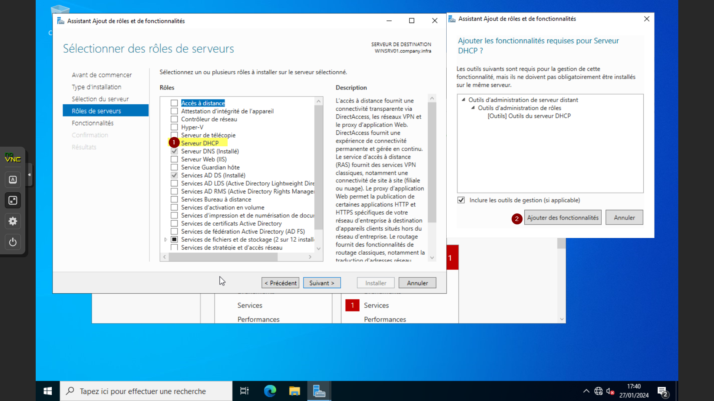
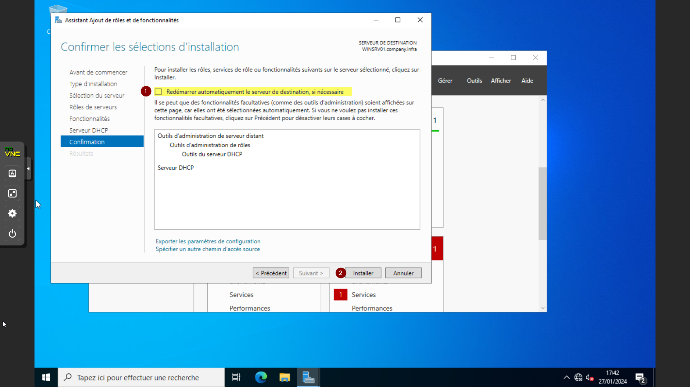
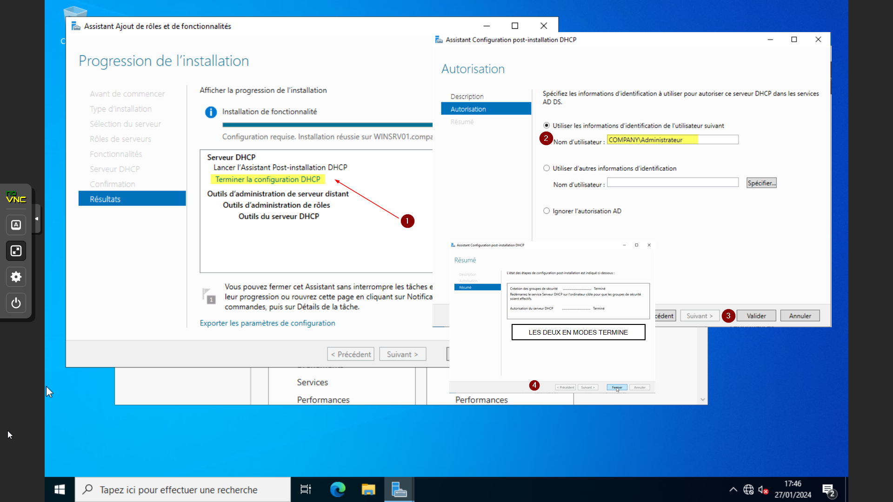
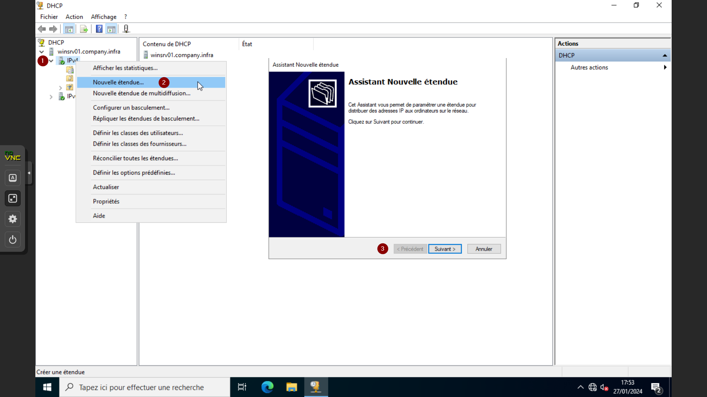
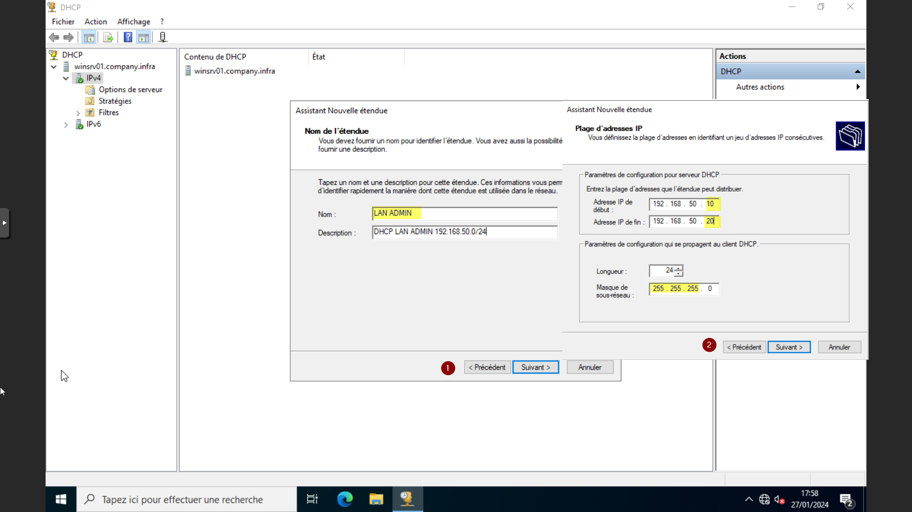
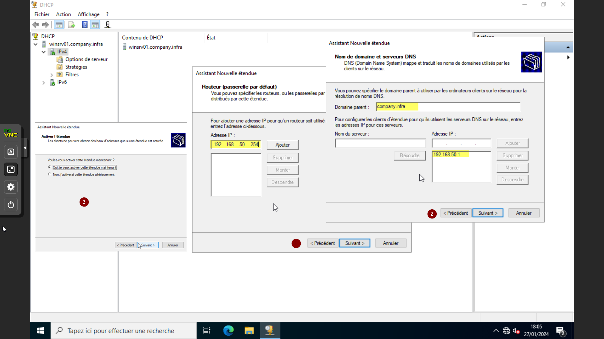
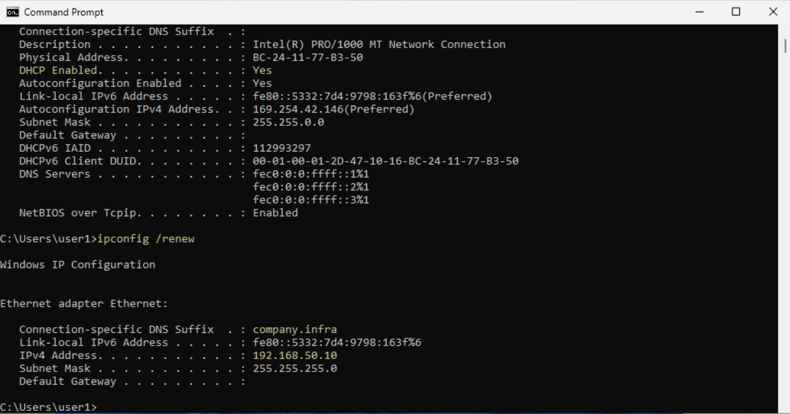

# DHCP sur Windows Server 2022

## Introduction & Prérequis

Bienvenue dans ce guide pratique qui vous aidera à mettre en place un serveur DHCP (Dynamic Host Configuration Protocol) sur votre réseau. Suivez ces étapes simples pour garantir une distribution dynamique et efficace des adresses IP à vos clients.

> C'est quoi le DHCP ?
> Le protocole DHCP est un protocole client/serveur qui fournit automatiquement une adresse IP et d'autres informations de configuration pertinentes à un hôte IP (par exemple, masque de sous-réseau et passerelle par défaut).

Liens utiles:
- https://learn.microsoft.com/fr-fr/windows-server/networking/technologies/dhcp/dhcp-top
- https://www.it-connect.fr/chapitres/dhcp-presentation-et-definitions/
- https://fr.wikipedia.org/wiki/Dynamic_Host_Configuration_Protocol

Prérequis:
- Suite aux guides: création d'une VM Windows Server 2022 et Active Directory Windows Server 2022
- Un domaine AD opérationnel
- Une machine Windows 10/11 pour tester

---

## Installation de la fonctionnalité DHCP

- Ouvrez le Gestionnaire de serveur
- Sélectionnez Ajouter des rôles et fonctionnalités
- Dans Rôle de serveur, sélectionnez DHCP
- Suivez l'assistant pour terminer l'installation

## Configuration du DHCP

Après l'installation, cliquez sur Terminer la configuration DHCP. Autorisez le serveur DHCP dans le domaine (compte Administrateur du domaine), puis validez. Dans le Résumé, les deux étapes doivent apparaître Terminées.

### Création d'une nouvelle étendue

- Lancez l'assistant de création d'étendue
- Saisissez un nom et une description
- Définissez la plage DHCP (ex: 192.168.50.10 à 192.168.50.20)
- Pas d'exclusions
- Durée du bail: 4 heures
- Définissez la passerelle par défaut (ex: 192.168.50.254)

### Les options DNS & WINS

#### DNS

Laissez la configuration par défaut si elle correspond à ce que vous souhaitez transmettre aux clients.

#### WINS

Non nécessaire pour ce guide simple.

.png)

### Activer l'étendue

À la fin de l'assistant, activez l'étendue quand cela est proposé.

---

## Résultat

### Phase de test

- Sur une machine cliente Windows, ouvrez une invite de commandes
- Tapez `ipconfig /all` pour afficher la configuration actuelle
- Tapez `ipconfig /renew` pour renouveler l'adresse IP

### Conclusion

Félicitations ! Vous avez maintenant un serveur DHCP opérationnel sur votre réseau. Les clients recevront automatiquement des adresses IP conformes à votre configuration. Ajustez les paramètres si nécessaire.

Liens complémentaires:
- https://learn.microsoft.com/fr-fr/windows-server/networking/technologies/dhcp/quickstart-install-configure-dhcp-server?tabs=powershell
- https://www.it-connect.fr/installer-et-configurer-un-serveur-dhcp-sous-windows-server-2019/
- https://www.lemagit.fr/conseil/Reseau-comment-configurer-un-serveur-DHCP-sur-Windows
