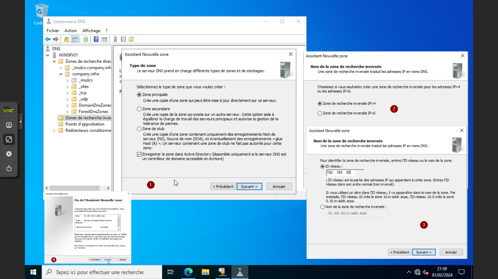
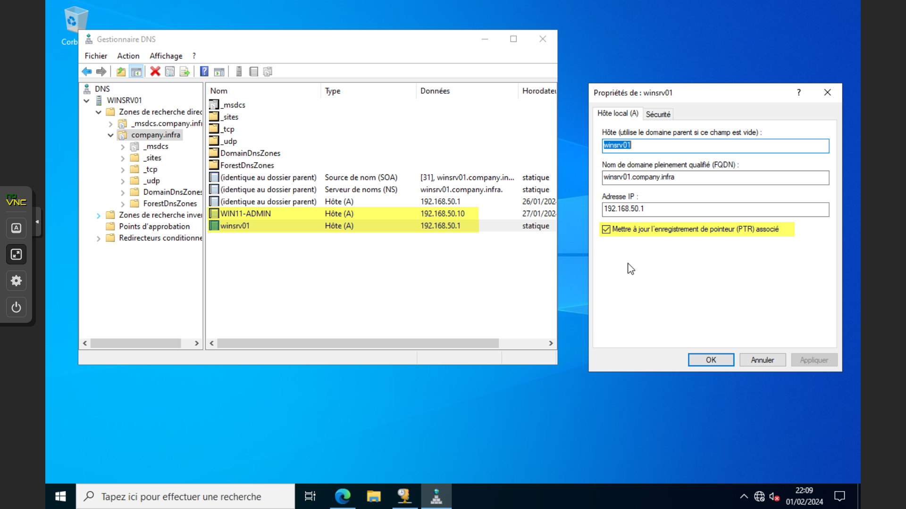
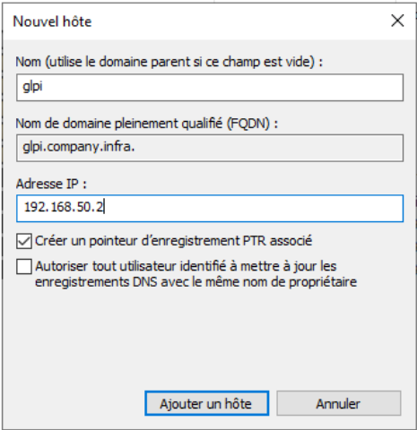
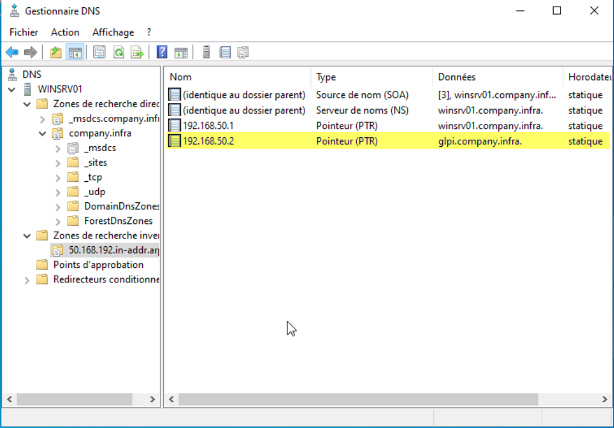
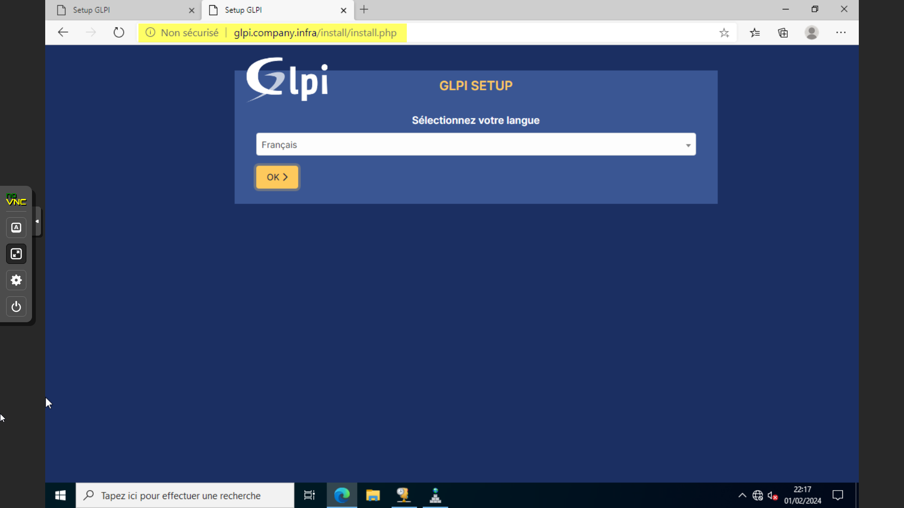

# DNS Sur Windows Server 2022

## Introduction & Prérequis

Bienvenue dans ce guide détaillé qui vous accompagnera dans la mise en place du service DNS sur votre serveur Windows Server 2022. Suivez attentivement ces étapes pour assurer une configuration correcte et optimale de votre service DNS.

### Prérequis

Ce guide s'intègre dans la suite de guides concernant Windows Server.
Assurez-vous d'avoir correctement configuré le paramétrage réseau de votre serveur.

---

## Ajouter le Rôle DNS

- Accédez au Gestionnaire de serveur
- Cliquez sur Ajouter des rôles et des fonctionnalités
- Sélectionnez Serveur DNS
- Suivez l'assistant pour terminer l'installation du rôle DNS

## Gestionnaire DNS

Ouvrez le Gestionnaire DNS depuis l'onglet Outils d'administration du Gestionnaire de serveur.

## Configuration de la Zone de Recherche Inversée

Créez une nouvelle zone en suivant ces étapes :

- Choisissez Nouvelle Zone
- Sélectionnez Zone Principale
- Choisissez l'option pour tous les serveurs DNS exécutés sur les contrôleurs de domaine dans ce domaine
- Spécifiez le nom du domaine (exemple: votre-domaine.local)
- Choisissez Zone IPv4
- Configurez l'ID réseau : 192.168.50.
- Autorisez uniquement les mises à jour dynamiques sécurisées

## Configuration de la Zone de Recherche Directe

Accédez aux propriétés des machines existantes, y compris le serveur Windows.
Créez une entrée PTR pour chaque machine et appliquez les configurations.

## Création de Redirection pour GLPI

Créez une redirection pour GLPI dans la zone de recherche directe.

---

