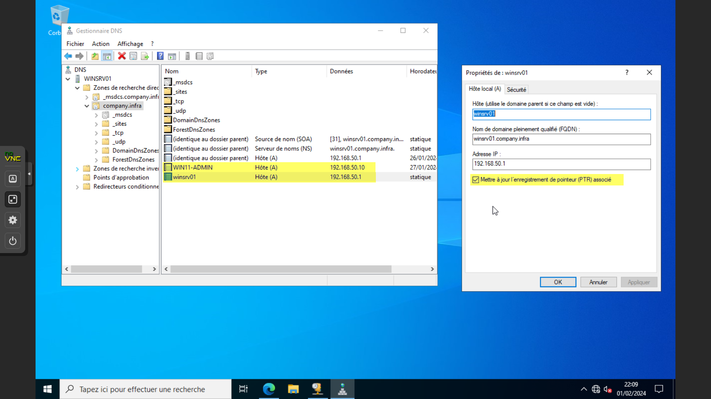
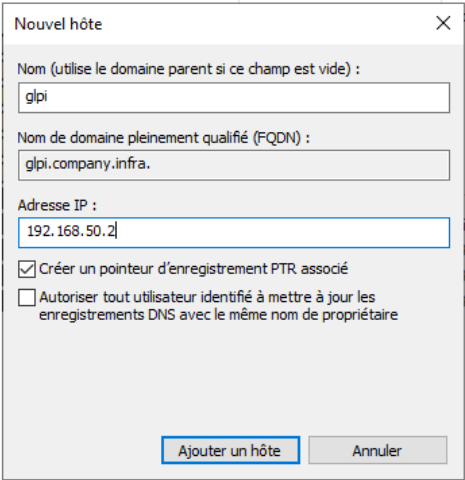

# DNS - Configuration d'une Zone de Recherche Inversée sous Windows Server 2022

## Introduction & Présentation

Bienvenue dans ce guide détaillé qui vous accompagnera dans la configuration d'une zone de recherche inversée sur un serveur DNS lié à l'Active Directory, sous Windows Server 2022. Nous verrons également comment créer des enregistrements PTR, propres à ce type de zone.

### Qu'est-ce qu'une Zone de Recherche Inversée ?

La zone de recherche inversée va permettre de **résoudre les adresses IP en nom**, ce qui revient à faire l'inverse de ce que l'on demande habituellement à un serveur DNS. Ainsi, si vous demandez à votre serveur DNS à qui correspond l'adresse IP "192.168.100.11", il devrait vous retourner le nom d'hôte correspondant.

### Pourquoi Configurer une Zone de Recherche Inversée ?

- **Très utile en phase de troubleshooting**
- Permet la résolution inverse (IP vers nom)
- Bonne pratique de sécurité et d'administration
- Nécessaire pour certaines applications et services

### Prérequis

- Serveur Windows Server 2022 avec rôle DNS installé
- Active Directory configuré
- Droits d'administration sur le serveur DNS
- Console DNS accessible

---

## Étape 1 : Créer une Zone de Recherche Inversée

### Accès à la Console DNS

Sur votre contrôleur de domaine, qui doit être également serveur DNS, ouvrez la console DNS. Vous pouvez aussi utiliser un serveur d'administration sur lequel sont installés les outils RSAT.

Au sein de cette console, vous pouvez visualiser vos **"Zones de recherche directes"**, tandis que la section **"Zones de recherche inversée"** est vide par défaut.


### Lancement de l'Assistant

1. Effectuez un **clic droit** sur **"Zones de recherche inversée"**
2. Cliquez sur **"Nouvelle zone..."**



### Configuration du Type de Zone

L'assistant de création d'une nouvelle zone se lance :

1. Choisissez **"Zone principale"**
2. **Cochez l'option** en bas de page pour que la zone soit inscrite dans l'Active Directory
3. Cliquez sur **"Suivant"**



### Réplication de la Zone

Cette zone doit être répliquée vers l'ensemble des serveurs DNS associés à ce domaine :

1. Choisissez **"Vers tous les serveurs DNS exécutés sur les contrôleurs de domaine dans ce domaine"**
2. Cliquez sur **"Suivant"**


### Type de Zone de Recherche

Sélectionnez **"Zone de recherche inversée IPv4"** pour un réseau local adressé en IPv4.


---

## Étape 2 : Configuration de l'ID Réseau

### Définition de l'ID Réseau

L'étape **"Nom de la zone de recherche inversée"** est cruciale :

1. Dans le champ **"ID réseau"**, déclarez le sous-réseau concerné
2. Exemple : indiquez **"192.168.100"** pour le réseau **"192.168.100.0/24"**
3. La zone sera automatiquement nommée : **100.168.192.in-addr.arpa**


### Mises à Jour Dynamiques

Pour la sécurité de la zone :

1. Cochez **"N'autoriser que les mises à jour dynamiques sécurisées"**
2. Cette option est recommandée en environnement Active Directory
3. Cliquez sur **"Suivant"**


### Finalisation

1. Vérifiez la configuration
2. Cliquez sur **"Terminer"**

La zone est immédiatement disponible et visible dans l'interface du serveur DNS.

---

## Étape 3 : Créer des Enregistrements PTR

### Qu'est-ce qu'un Enregistrement PTR ?

Un **enregistrement PTR** permet de fournir le nom de domaine (FQDN) associé à une adresse IP. Il permet de retourner le nom DNS d'un hôte à partir de son adresse IP. C'est un enregistrement spécifique aux zones de recherche inversée.

### Création Manuelle d'un Enregistrement PTR

#### Via l'Interface Graphique

1. **Clic droit** sur la zone de recherche inversée
2. Sélectionnez **"Nouveau pointeur (PTR)"**
3. Spécifiez :
   - **Adresse IP** de l'hôte
   - **Nom d'hôte complet** (FQDN) : nom de la machine + nom du domaine AD
4. **Validez** la création


#### Via PowerShell

Vous pouvez créer un enregistrement PTR avec une commande PowerShell :

```powershell
Add-DnsServerResourceRecordPtr -ZoneName "100.168.192.in-addr.arpa" -Name "11" -PtrDomainName "srv-adds-01.it-connect.local" -TimeToLive 01:00:00
```

**Paramètres :**
- **-ZoneName** : nom de la zone de recherche inversée
- **-Name** : adresse IP de l'hôte (ex: "11" pour l'IP "192.168.100.11")
- **-PtrDomainName** : nom d'hôte (FQDN)
- **-TimeToLive** : durée de mise en cache (facultatif)

### Enregistrements Automatiques

Par défaut, les machines Windows sont configurées pour s'enregistrer automatiquement dans le DNS (enregistrements A et PTR), y compris les machines adressées en DHCP.

Pour les machines avec une **adresse IP fixe** (serveurs), vous devez créer manuellement les enregistrements PTR.

---

## Étape 4 : Vérification et Test

### Test avec nslookup

Pour vérifier le bon fonctionnement de la zone de recherche inversée :

```cmd
nslookup 192.168.100.11
```

**Résultat attendu :**
- Avant configuration : erreur ou pas de réponse
- Après configuration : retour du nom d'hôte correspondant


### Vérification dans la Console DNS

1. Ouvrez la console DNS
2. Naviguez vers **"Zones de recherche inversée"**
3. Vérifiez la présence de votre zone
4. Contrôlez les enregistrements PTR créés


---

## Bonnes Pratiques et Conseils

### Gestion des Enregistrements

- **Créez des zones de recherche inversée** pour tous vos sous-réseaux
- **Maintenez la cohérence** entre enregistrements A et PTR
- **Utilisez des scripts PowerShell** pour automatiser la création d'enregistrements multiples

### Sécurité

- **Activez les mises à jour dynamiques sécurisées** uniquement
- **Limitez les droits** de modification des zones DNS
- **Surveillez les modifications** des enregistrements PTR

### Maintenance

- **Vérifiez régulièrement** la cohérence des enregistrements
- **Supprimez les enregistrements obsolètes**
- **Documentez vos configurations** DNS

---

## Script PowerShell Avancé

### Création Automatique d'Enregistrements PTR

```powershell
# Récupération des enregistrements A existants
$ARecords = Get-DnsServerResourceRecord -ZoneName "votre-domaine.local" -RRType A

# Création des enregistrements PTR correspondants
foreach ($Record in $ARecords) {
    $IP = $Record.RecordData.IPv4Address.ToString()
    $Name = $Record.HostName
    $FQDN = "$Name.votre-domaine.local"
    
    # Extraction de la dernière partie de l'IP
    $LastOctet = $IP.Split('.')[-1]
    
    try {
        Add-DnsServerResourceRecordPtr -ZoneName "100.168.192.in-addr.arpa" -Name $LastOctet -PtrDomainName $FQDN
        Write-Host "Enregistrement PTR créé pour $IP -> $FQDN" -ForegroundColor Green
    }
    catch {
        Write-Host "Erreur lors de la création de l'enregistrement PTR pour $IP" -ForegroundColor Red
    }
}
```

---

## Dépannage

### Problèmes Courants

**Erreur : "Zone not found"**
- Vérifiez que la zone de recherche inversée existe
- Contrôlez l'orthographe du nom de zone

**Enregistrement PTR non résolu**
- Vérifiez la configuration du client DNS
- Contrôlez les paramètres de cache DNS

**Permissions insuffisantes**
- Vérifiez les droits sur la zone DNS
- Assurez-vous d'être membre du groupe DnsAdmins

### Commandes de Diagnostic

```powershell
# Lister les zones de recherche inversée
Get-DnsServerZone | Where-Object {$_.IsReverseLookupZone -eq $true}

# Lister les enregistrements PTR d'une zone
Get-DnsServerResourceRecord -ZoneName "100.168.192.in-addr.arpa" -RRType Ptr

# Test de résolution inversée
Resolve-DnsName -Name "192.168.100.11" -Type PTR
```

---

## Conclusion

Vous venez de mettre en place **une zone de recherche inversée au sein de votre serveur DNS** ! Désormais, vous pouvez effectuer :

- **Résolution de noms en adresses IP** (recherche directe)
- **Résolution d'adresses IP en noms** (recherche inversée)

Cette configuration est essentielle pour :
- Le **troubleshooting réseau**
- La **sécurité** et l'audit
- Le **bon fonctionnement** de certaines applications

La zone de recherche inversée est maintenant opérationnelle et prête à être utilisée dans votre infrastructure Windows Server 2022.

---

## Références

- [Microsoft Learn - Add-DnsServerResourceRecordPtr](https://docs.microsoft.com/en-us/powershell/module/dnsserver/add-dnsserverresourcerecordptr)
- [Microsoft Learn - DNS - Mises à jour dynamiques](https://docs.microsoft.com/en-us/windows-server/networking/dns/manage-dns-zones)
- [IT-Connect - DNS sous Windows Server 2022](https://www.it-connect.fr/dns-sous-windows-server-2022-comment-configurer-une-zone-de-recherche-inversee/)
