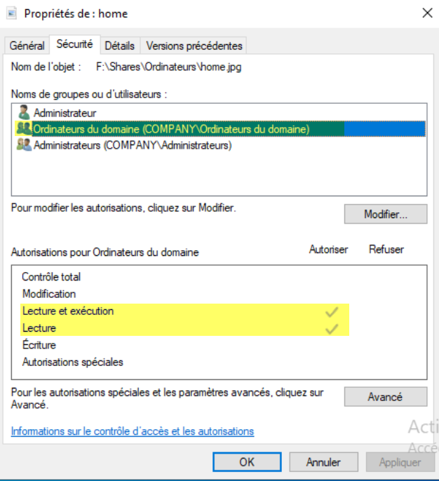
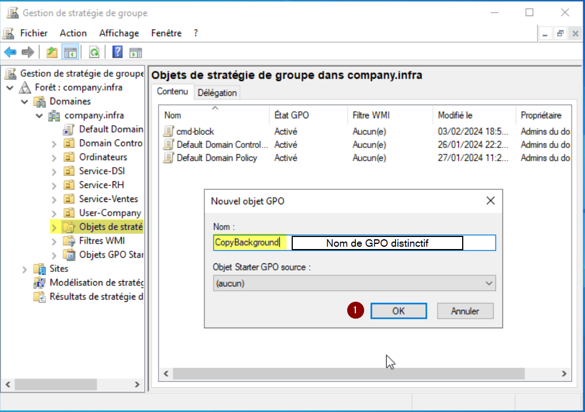
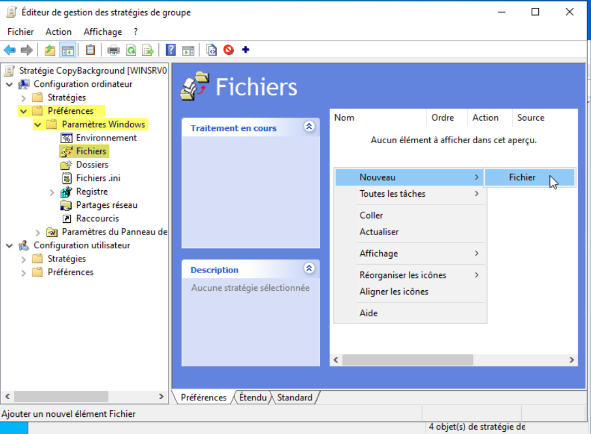
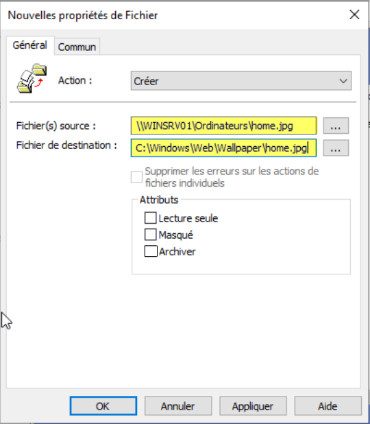
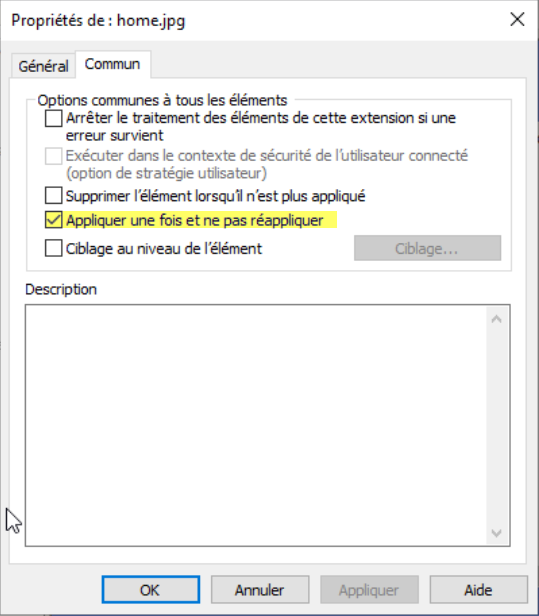
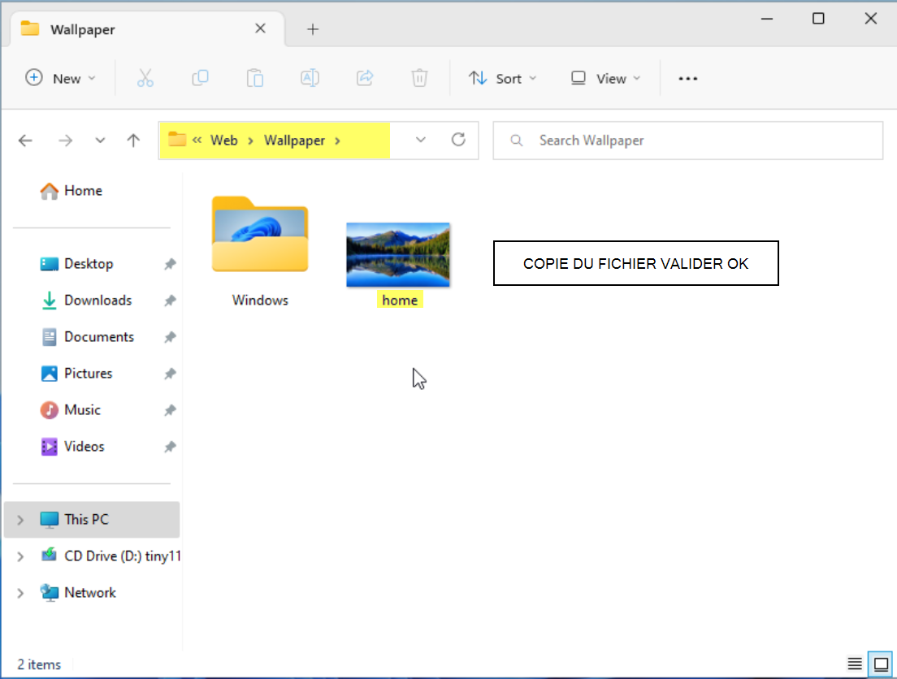
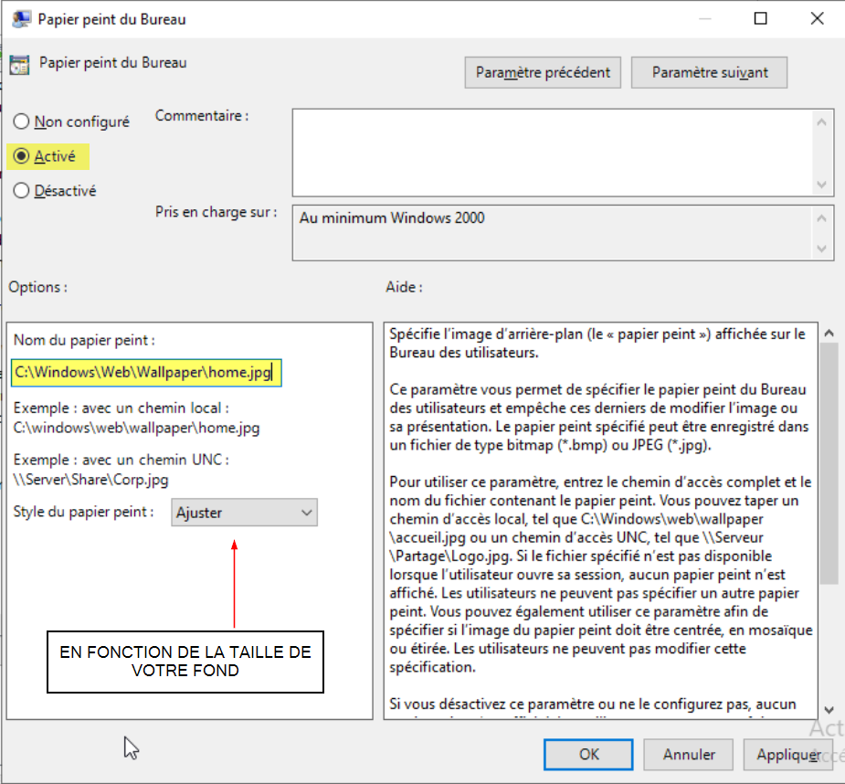
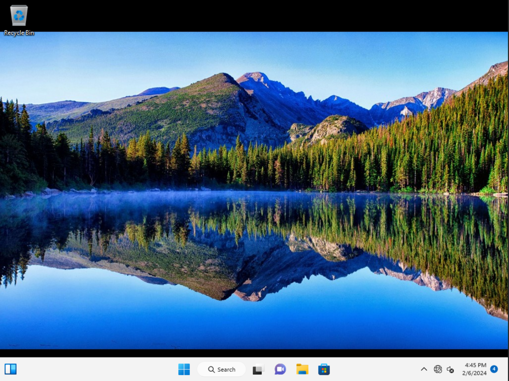

# Stratégies de Groupes (GPO) sous Windows Server 2022

## Introduction & Prérequis

Les Objets de Stratégie de Groupe (GPO) permettent de centraliser la configuration des ordinateurs et utilisateurs dans un domaine Active Directory: paramètres de sécurité, déploiement logiciels, restrictions, etc.

Prérequis:
- Windows Server installé et opérationnel
- Domaine Active Directory fonctionnel
- Compte Administrateur du domaine
- Outil GPMC (Group Policy Management Console) installé

---

## GPO pour bloquer l'accès au CMD

### Ouverture de « Gestion des Stratégies de Groupe »

Ouvrez la console de gestion des stratégies de groupe (GPMC) sur le serveur.

### Création de la GPO « cmd-block »

- Développez jusqu'à « Objets de Stratégie de Groupe »
- Clic droit > Nouveau > nommez « cmd-block »

### Modification des paramètres de la GPO

- Clic droit sur « cmd-block » > Modifier
- Chemin: Configuration Utilisateur > Stratégies > Modèles d’Administration > Système
- Paramètre: « Désactiver l'accès à l'invite de commandes »
- Mettez « Activé » et désactivez le traitement des scripts d'invite de commande (Oui)

### Liaison de la GPO à une OU

- Sur l’OU ciblée > clic droit > « Lier un objet de stratégie de groupe existant »
- Sélectionnez « cmd-block » puis « Appliquer »

### Mise à jour sur un poste client

- Sur un poste ciblé: `gpupdate` puis `gpupdate /force`
- Vérifiez avec `gpresult /R`

### Redémarrage du poste client

Redémarrez le poste pour appliquer la politique.

### Vérification de l'interdiction d'accès au CMD

- Connectez-vous avec un compte ciblé
- Ouvrez CMD: l'accès doit être bloqué

---

## Deux GPO pour déployer un fond d'écran

### GPO « CopyBackground » (copie du fichier)

#### Déplacer le fond d'écran

Déposez le fond dans un partage accessible aux ordinateurs du domaine.

#### Création de la GPO

Créez une GPO « CopyBackground ».

#### Modification de la GPO

Chemin: Configuration Ordinateur > Préférences > Paramètres Windows > Fichiers

##### Création du nouveau fichier

- Action: Créer
- Source: chemin réseau du fond
- Cible: `C:\Windows\Web\Wallpaper\home.jpg`
- Attributs: décochés

#### Partie « Commun »

Cochez « Appliquer une fois et ne pas réappliquer ».

#### Application de la GPO

- Appliquer puis OK
- Redirigez les ordinateurs vers l’OU « Ordinateurs » (ex: `redircmp ou=Ordinateur,DC=company,DC=infra`)
- Appliquez la GPO à l’OU « Ordinateurs »

### GPO « DeployBackground » (appliquer le fond)

#### Création de la GPO

Créez une GPO « DeployBackground ».

#### Modification

Chemin: Configuration Utilisateur > Stratégies > Modèles d’Administration > Bureau > Bureau > Papier peint du Bureau

#### Paramètres

- Activer
- Nom du papier peint: chemin local du fichier copié

#### Liaison et application

- Liez « DeployBackground » à l’OU ciblée
- Appliquez la GPO

#### Vérification

---

