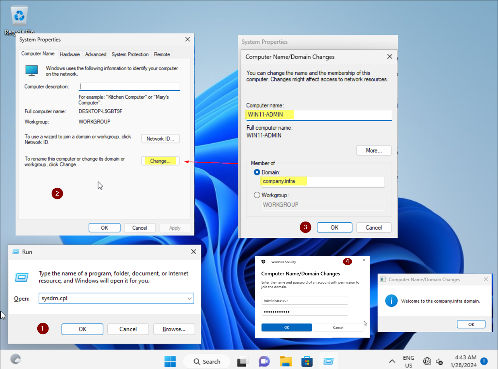

# Joindre une machine Windows à un Domaine

## Introduction & Prérequis

Bienvenue dans ce guide détaillé qui vous accompagne pour joindre une machine Windows à un domaine Active Directory.

### Prérequis

Ce guide s’inscrit dans la suite Windows Server 2022 (VM, AD, DHCP).
Avant de commencer, préparez:
- Nom du domaine
- Identifiants d’administrateur du domaine

---

## Joindre le Domaine

- Windows + R
- Tapez `sysdm.cpl`
- Dans Propriétés Système, cliquez sur « Modifier »
- Sélectionnez « Domaine » puis saisissez votre domaine
- Validez avec « OK »
- Entrez les identifiants Administrateur du domaine
- Attendez le message de bienvenue dans le domaine

---

## Résultat

- Redémarrez la machine
- Connectez-vous avec un compte du domaine

---
