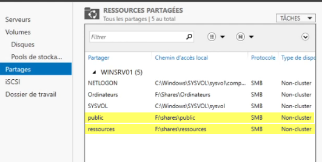
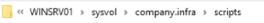
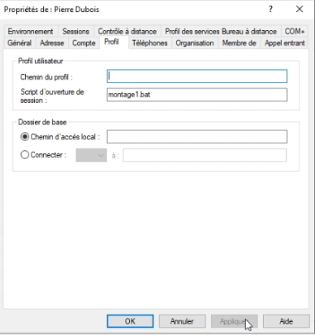
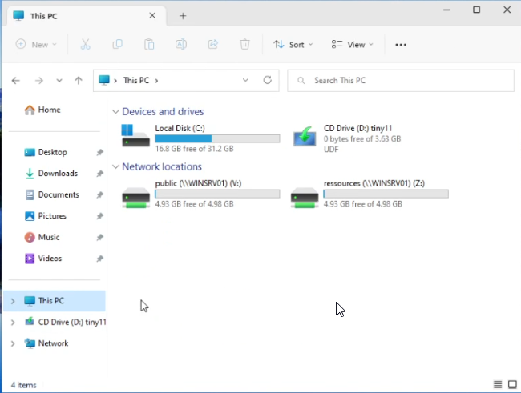
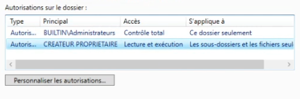
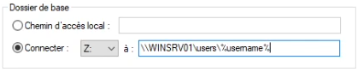
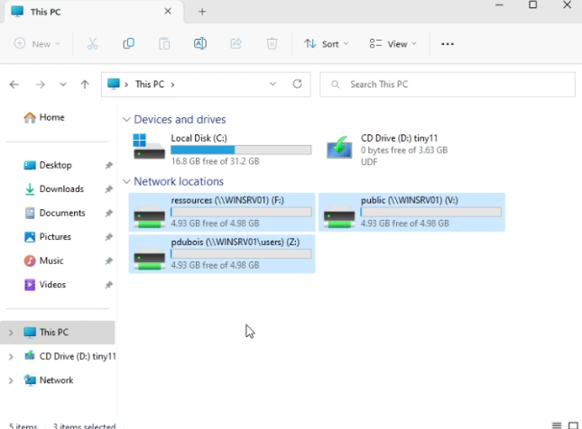

# Configuration Automatisée des Partages Réseau et des Dossiers Utilisateurs

## Introduction & Prérequis

Ce guide vous montre comment automatiser le montage de partages réseau pour les utilisateurs de l'Active Directory (AD) sur un serveur Windows. En outre, nous verrons comment créer automatiquement un dossier personnel pour chaque utilisateur.

### Prérequis

- Un serveur Windows fonctionnel
- Un utilisateur et une machine cliente dans le domaine Active Directory
- Une connaissance de base des partages réseau sous Windows Server

---

## Scripts pour les Partages Réseau

### Création des Partages

Tout d'abord, créez vos partages réseau avec les autorisations appropriées. Assurez-vous qu'ils sont accessibles et configurés selon vos besoins.



### Écriture du Script de Montage

Ensuite, créez un script de montage pour chaque partage. Écrivez les scripts à l'emplacement approprié (par exemple un partage \NETLOGON ou un dossier centralisé de scripts).



Exemple de contenu pour un script de connexion:

```bat
net use Z: \\serveur\partage1
net use Y: \\serveur\partage2
```


### Attribution du Script dans l'AD

Dans l'Active Directory, accédez au profil de l'utilisateur et spécifiez le chemin complet du script de montage dans la section d'ouverture de session.



### Résultat

> La Première partie est fonctionnelle



---

## Configuration du Dossier Personnel

### Configuration des Autorisations

Configurez les autorisations du dossier utilisateur pour garantir la sécurité et l'accessibilité appropriées.



### Attribution de la Lettre de Lecteur dans l'AD

Dans l'Active Directory, configurez le dossier personnel de l'utilisateur en lui attribuant une lettre de lecteur pour un accès facile.



### Résultat



---

Référence: https://docs.ldurand-it.fr/fr/Services/Windows-Server/networkshareauto
