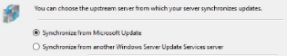

# WSUS sur Windows Server 2022

## Introduction & Prérequis

Bienvenue dans ce guide d'installation de Windows Server Update Services (WSUS) sur Windows Server 2022. WSUS permet de centraliser et contrôler le déploiement des mises à jour Microsoft.

Prérequis:
- Un serveur Windows Server 2022 opérationnel différent de votre DC (contrôleur de domaine)
- Accès Internet pour WSUS
- Postes clients
- Le serveur WSUS joint au domaine
- De préférence une redirection DNS vers le serveur WSUS (ex: http://wsus.company.infra)

---

## Installation WSUS

- Ouvrez « Gérer » dans le Gestionnaire de serveur
- Ajoutez des rôles et fonctionnalités
- Sélectionnez « Services de mise à jour Windows (WSUS) » et incluez les outils de gestion WSUS

- Cochez la connectivité WID (Windows Internal Database) et les services WSUS

- Spécifiez l'emplacement des mises à jour (ex: C:\\Updates)

L'installation démarre…

### Tâches de Post-installation

- Lancez les tâches de post-installation pour configurer WSUS

---

## Configuration de WSUS

Ouvrez l'application Services WSUS et suivez l'assistant:

- Ne pas rejoindre le programme Microsoft

- Synchroniser depuis Microsoft Update

- Sans proxy

- Langues: Anglais et Français

- Produits: ex. Windows 11

- Types de mises à jour: critiques, sécurité, mises à jour, définitions

- Planifier la synchronisation automatique (ex: 02:00:00, quotidien)

- Lancer la première synchronisation initiale

---

## Résultat

Vous avez installé et configuré WSUS sur Windows Server 2022. Vous pouvez désormais gérer et distribuer les mises à jour Microsoft dans votre environnement.

Liens utiles:
- https://learn.microsoft.com/fr-fr/windows-server/administration/windows-server-update-services/get-started/windows-server-update-services-wsus
- https://www.it-connect.fr/chapitres/qu-est-ce-qu-un-serveur-wsus/
- https://www.it-connect.fr/cours-tutoriels/administration-systemes/windows-server/wsus/
