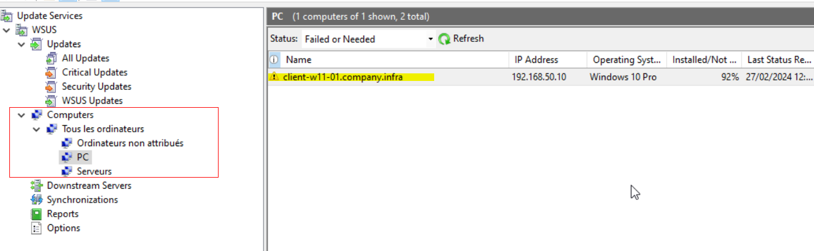

# Joindre des Ordinateurs à WSUS (via GPO)

## Introduction & Prérequis

Maintenant que WSUS est déployé et intégré sur un serveur Windows Server 2022, faisons remonter les machines du domaine dans la console WSUS à l'aide de stratégies de groupe (GPO).

Ce guide couvre toutes les étapes nécessaires pour intégrer efficacement vos machines à WSUS avec des GPO.

Prérequis:
- Un serveur Windows avec le rôle WSUS installé et configuré
- Connaissances de base des GPO dans un environnement Active Directory
- Accès administratif au domaine AD pour créer et appliquer des GPO
- Droits nécessaires pour installer des fonctionnalités sur le serveur WSUS

---

## Intégration des Ordinateurs

### Modifier la méthode d'affectation des ordinateurs

Créez deux groupes dans WSUS (Postes Clients et Serveurs) depuis la section Tous les ordinateurs. Puis, dans Options > Computers, sélectionnez Use Group Policy or registry settings on computers.

### Installation des Outils ADMX Windows 11 (facultatif)

Téléchargez la dernière version des modèles d'administration: https://www.microsoft.com/en-us/download/details.aspx?id=105667

Chemin des templates après installation:
`C:\Program Files (x86)\Microsoft Group Policy\Windows 11 Month Year Update (XXHX)\PolicyDefinitions`

Copiez:
- Dossiers `fr-fr` et `en-US`
- Tous les fichiers `.admx`

Dans: `\\WINSRVO1\sysvol\company.infra\Policies\PolicyDefinitions`

> Adaptez les chemins selon votre environnement et créez `PolicyDefinitions` s'il n'existe pas.

---

## Création des GPO

Nous allons créer:
- GPO « WSUS - Main Settings »: paramètres communs pour tous les ordinateurs
- GPO « WSUS - PC »: groupe cible WSUS + heures d'activité pour postes clients
- GPO « WSUS - Serveurs »: identique à PC mais pour serveurs (changer groupe/horaires)

### GPO - Paramètres Généraux

Définir:
- Adresse du serveur WSUS
- Paramètres de mises à jour automatiques
- Désactiver la connexion au serveur Microsoft de Windows Update

Chemins de paramètres:
- Configuration ordinateur > Stratégies > Modèles d’administration > Composants Windows > Windows Update > Gérer les mises à jour proposées de Windows Server Update Service > Spécifier l’emplacement intranet du service de mise à jour Microsoft

- Configuration ordinateur > Stratégies > Modèles d’administration > Composants Windows > Windows Update > Gérer l’expérience utilisateur final > Configuration du service Mises à jour automatique

- Configuration ordinateur > Stratégies > Modèles d’administration > Composants Windows > Windows Update > Gérer les mises à jour proposées de Windows Server Update Service > Ne pas se connecter à des emplacements Internet Windows Update

### GPO - Postes Clients

Définir:
- Ciblage côté client vers le groupe WSUS « Postes Clients »
- Désactiver le redémarrage automatique pendant les heures d’activité

Chemins de paramètres:
- Configuration ordinateur > Stratégies > Modèles d’administration > Composants Windows > Windows Update > Gérer les mises à jour proposées de Windows Server Update Service > Autoriser le ciblage côté client

- Configuration ordinateur > Stratégies > Modèles d’administration > Composants Windows > Windows Update > Gérer l’expérience utilisateur final > Désactiver le redémarrage automatique pour les mises à jour pendant les heures d’activité

---

## Test des GPO

- Appliquez les GPO aux OU correspondantes
- Sur un poste client: `gpupdate /force`, redémarrez, puis lancez une recherche de mises à jour

Dans la console WSUS, le poste client doit apparaître.

---

## Résultat

Félicitations ! Vous avez intégré vos machines à WSUS via GPO. Surveillez régulièrement la console WSUS pour vérifier la synchronisation et le déploiement des mises à jour.

Liens utiles:
- https://www.it-connect.fr/gpo-windows-11-22h2-comment-telecharger-les-modeles-admx/
- https://www.microsoft.com/en-us/download/details.aspx?id=104593
- https://www.it-connect.fr/chapitres/lier-les-machines-du-domaine-active-directory-serveur-wsus/

